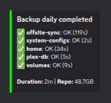

# Restic Backup System

After a close call with a failing drive that almost took my Plex database with it, I built this to back up everything automatically — Docker volumes, system configs, the Plex DB (without the 40GB of regenerable cache), and my home directory. Everything's encrypted and synced offsite to Google Drive. It runs on cron and sends Discord notifications so I know it's working without having to check.

Modular design — each backup target is its own script, so you can run just what you need or add new modules without touching the orchestrator.

> **Production context:** This runs nightly on my [49-service self-hosted media server](https://github.com/tylerbcrawford/infrastructure-showcase), protecting Docker volumes, the Plex database, system configs, and home directories in a local restic repo that is mirrored offsite to Google Drive.

<p align="center">
  <br>
  <sub>Each run reports per-module status, duration, and repo size to Discord.</sub>
</p>

## Features

- **Orchestrated backup modes** — daily and weekly schedules with a single entry point
- **Docker volume backup** — backs up named Docker volumes via a lightweight container (no host path hacking)
- **Plex database backup** — targeted backup of just the Plex DB, skipping the 40GB+ of regenerable cache
- **System config backup** — captures `/etc/nginx`, `fstab`, `hosts`, crontabs, Docker Compose files, and installed packages
- **Home directory backup** — full home backup with configurable exclusions (caches, browser data, etc.)
- **Offsite Google Drive sync** — mirrors the encrypted restic repo to GDrive via rclone with size verification
- **Discord webhook notifications** — rich embeds showing per-module pass/fail, duration, and repo size
- **Snapshot pruning** — configurable retention policy (default: 7 daily, 4 weekly, 6 monthly)
- **Integrity verification** — weekly checks: 5% data sampling, snapshot freshness, disk space, GDrive sync status
- **Full system image backup** — compressed dd images with progress monitoring and automatic Docker stop/start (extras)
- **Drive preparation utility** — format and configure a backup drive with one command (extras)

## Skills Demonstrated

- **Encryption at rest** — restic encrypts every snapshot with a key held outside the repo, so a stolen drive or GDrive account exposes nothing.
- **3-2-1 backup strategy** — local restic snapshots, a second on-site copy via the `dd` imaging extra, and an offsite mirror to Google Drive.
- **Integrity sampling** — a weekly `restic check` reads a 5% data subset and validates snapshot freshness, local and offsite disk space, and GDrive sync status.
- **Modular Bash** — a thin orchestrator sequences independent module scripts, captures per-module pass/fail with timings, and sends one summary. Any module also runs standalone.

## Architecture

```
backup-orchestrator.sh          # Entry point: --daily, --weekly, --dry-run
├── lib/
│   ├── config.sh               # All configuration (paths, thresholds, env vars)
│   ├── common.sh               # Logging, locking, preflight, module runner
│   ├── discord-notify.sh       # Discord webhook embed sender
│   └── branding.sh             # Bot identity for Discord messages
└── modules/
    ├── backup-volumes.sh       # Docker volume backup via container
    ├── backup-plex-db.sh       # Plex database targeted backup
    ├── backup-system-configs.sh # System configuration files
    ├── backup-home.sh          # Home directory with exclusions
    ├── offsite-sync.sh         # rclone sync to Google Drive
    ├── prune-snapshots.sh      # Retention policy enforcement
    └── verify-backup.sh        # Integrity and freshness checks
```

The orchestrator runs each module in sequence, captures pass/fail results, and sends a summary to Discord. Modules are independent scripts — you can run any module standalone or add new ones without modifying the orchestrator.

## Prerequisites

- [restic](https://restic.net/) (backup engine)
- [rclone](https://rclone.org/) (offsite sync to Google Drive)
- [Docker](https://docs.docker.com/engine/install/) (for volume backup module)
- `curl` (Discord notifications)
- `pigz` (parallel gzip, used by extras/system-backup.sh)

## Quick Start

```bash
# 1. Clone
git clone https://github.com/tylerbcrawford/restic-backup-system.git
cd restic-backup-system

# 2. Configure
cp .env.example .env
# Edit .env with your paths, webhook URL, etc.

# 3. Initialize restic repo (if new)
source .env
restic init --repo "$RESTIC_REPOSITORY"

# 4. Make scripts executable
chmod +x backup-orchestrator.sh modules/*.sh extras/*.sh

# 5. Test with dry-run
source .env && ./backup-orchestrator.sh --dry-run

# 6. Run first backup
source .env && ./backup-orchestrator.sh --daily
```

## Configuration

All configuration is centralized in `lib/config.sh`, which reads from environment variables with sensible defaults. Copy `.env.example` to `.env` and customize:

| Variable | Description | Default |
|----------|-------------|---------|
| `RESTIC_REPOSITORY` | Path to your restic repository | `/path/to/restic/repo` |
| `RESTIC_PASSWORD_FILE` | Path to restic password file | `$HOME/.config/restic/password` |
| `GDRIVE_DEST` | rclone destination for offsite sync | `gdrive:Backups/restic` |
| `DISCORD_WEBHOOK` | Discord webhook URL for notifications | (required) |
| `BOT_USERNAME` | Discord bot display name | `Backup Bot` |
| `BOT_AVATAR_URL` | Discord bot avatar URL | (empty) |
| `DOCKER_DIR` | Directory containing `docker-compose.yml` | `/path/to/docker-compose-directory` |
| `COMPOSE_PROJECT_NAME` | Docker Compose project name (volume prefix) | `myproject` |
| `PLEX_VOLUME` | Plex config volume name | `${COMPOSE_PROJECT_NAME}_plex_config` |
| `BACKUP_HOME_DIR` | Home directory to back up | `$HOME` |
| `LOG_DIR` | Log file directory | `/var/log/backup-system` |

### Retention Policy

Configured in `lib/config.sh`:

```bash
KEEP_DAILY=7       # Keep 7 daily snapshots
KEEP_WEEKLY=4      # Keep 4 weekly snapshots
KEEP_MONTHLY=6     # Keep 6 monthly snapshots
```

### Alert Thresholds

```bash
GDRIVE_FREE_MIN_GB=50     # Warn if GDrive free space drops below 50GB
RESTIC_REPO_MAX_GB=45     # Warn if local repo exceeds 45GB
LOCAL_FREE_MIN_GB=20      # Warn if local disk free space drops below 20GB
SNAPSHOT_MAX_AGE_HOURS=26  # Warn if newest snapshot is older than 26 hours
```

## Usage

### Backup Modes

```bash
# Source your .env first
source .env

# Daily backup: volumes + plex + configs + home + offsite sync
./backup-orchestrator.sh --daily

# Weekly backup: daily + prune snapshots + integrity verification
./backup-orchestrator.sh --weekly

# Dry run: show repo status, disk space, what would run
./backup-orchestrator.sh --dry-run
```

### Individual Modules

Each module can be run independently:

```bash
source .env
./modules/backup-volumes.sh        # Just Docker volumes
./modules/backup-plex-db.sh        # Just Plex DB
./modules/backup-system-configs.sh # Just system configs
./modules/backup-home.sh           # Just home directory
./modules/offsite-sync.sh          # Just GDrive sync
./modules/prune-snapshots.sh       # Just pruning
./modules/verify-backup.sh         # Just verification
```

### Cron Setup

```bash
# Mon-Sat 4AM: daily backup
0 4 * * 1-6 cd /path/to/restic-backup-system && source .env && ./backup-orchestrator.sh --daily >> /var/log/backup-system/cron.log 2>&1

# Sunday 6AM: weekly backup (daily + prune + verify)
0 6 * * 0 cd /path/to/restic-backup-system && source .env && ./backup-orchestrator.sh --weekly >> /var/log/backup-system/cron.log 2>&1
```

## Extras

### system-backup.sh

Full system image backup using `dd` + `pigz`. Creates compressed images of your EFI and root partitions to an external drive. Includes:

- Real-time progress monitoring via `/proc` polling
- Automatic Docker stop/start with verification
- Backup manifest with system info
- Automatic cleanup of old images (configurable retention)
- Dry-run mode

```bash
# Must be run as root
sudo bash extras/system-backup.sh --dry-run    # Preview
sudo bash extras/system-backup.sh              # Interactive
sudo bash extras/system-backup.sh --yes        # Non-interactive (for cron)
```

**Important:** Edit the `SRC_DISK`, `SRC_EFI`, and `SRC_ROOT` variables to match your system's partition layout. Run `lsblk` to identify your drives.

### prepare-backup-drive.sh

One-shot utility to format and prepare a backup drive:

- Installs dependencies (partclone, pv, restic, pigz)
- Validates target device (size check, not system drive, not mounted)
- Creates GPT + ext4 partition
- Configures fstab (noauto mount)
- Creates directory structure
- Writes restore instructions to the drive

```bash
# Must be run as root
sudo bash extras/prepare-backup-drive.sh
```

**Important:** Edit `TARGET_DEVICE` and `EXPECTED_SIZE_GB` before running.

## Directory Structure

```
restic-backup-system/
├── backup-orchestrator.sh       # Main entry point
├── lib/
│   ├── config.sh                # Central configuration
│   ├── common.sh                # Shared functions (logging, locking, etc.)
│   ├── discord-notify.sh        # Discord webhook notifications
│   └── branding.sh              # Bot identity for Discord
├── modules/
│   ├── backup-volumes.sh        # Docker volume backup
│   ├── backup-plex-db.sh        # Plex database backup
│   ├── backup-system-configs.sh # System config backup
│   ├── backup-home.sh           # Home directory backup
│   ├── offsite-sync.sh          # Google Drive sync
│   ├── prune-snapshots.sh       # Snapshot pruning
│   └── verify-backup.sh         # Integrity verification
├── extras/
│   ├── system-backup.sh         # Full system dd image backup
│   └── prepare-backup-drive.sh  # Drive formatting utility
├── docs/
│   └── architecture.md          # Architecture documentation
├── .env.example                 # Configuration template
├── .gitignore
├── LICENSE                      # MIT
└── README.md
```

## Customizing Volume List

Edit the `VOLUMES` array in `modules/backup-volumes.sh` to match your Docker setup. The volume names follow the pattern `${COMPOSE_PROJECT_NAME}_<service>_config`. Run `docker volume ls` to see your available volumes.

## License

MIT
